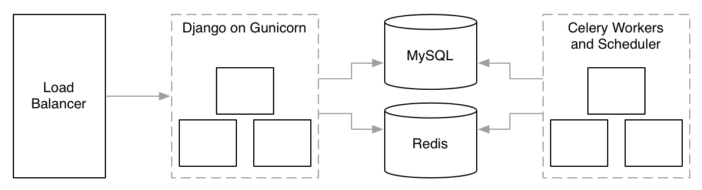
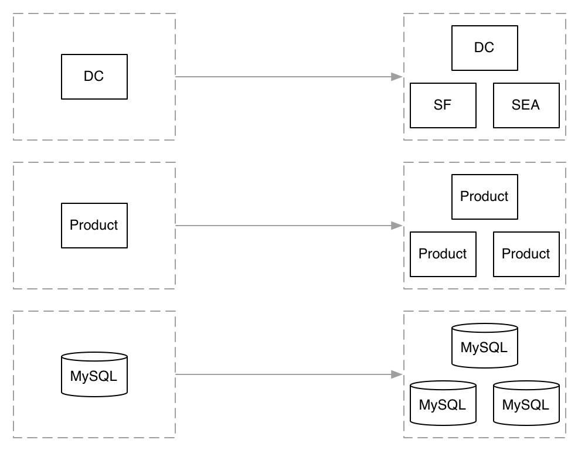
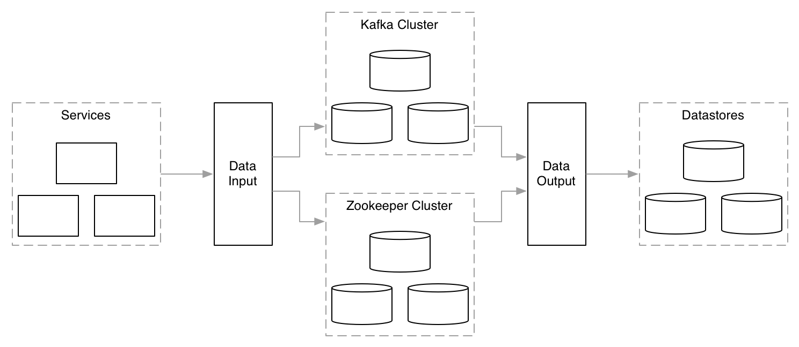

!SLIDE left

## Issues to address

1. right now it's a bit incoherent, trying to tell two different stories and having trouble weaving them together
2. should consider removing the non-data scaling storyline entirely, or radically simplifying it
3. Maybe we should call it, from SoA Data Silos to a Unified Data Pipeline

!SLIDE

# Building Data Infrastructure

## Will Larson ([@lethain](https://twitter.com/Lethain))
## SocialCode ([@socialcodeinc](https://twitter.com/socialcodeinc))

!SLIDE

>> When an increase of data, in quantity or kind,
>> causes your tools or approach to fail.

!SLIDE left

## A map of what's to come

1. A monolithic Python application
2. Many kinds of growth
3. Data becomes the bottleneck
4. Building a data pipeline
5. Questions

!SLIDE largeimg

## A familiar monolith

!SLIDE largeimg

## When an increase...

!SLIDE left

## ...causes your tools or approach to break.

* Complex deployments.
* Tight coupling.
* Siloed Data.

!SLIDE left

## Data will break you in various ways.

* Schema changes.
* Silos.
* Incompatible requirements.
* Growth.

!SLIDE left

## How to tame your data?

1. Embrace the silos?
2. Unify collection and storage?
3. Pipeline for sharing data?

!SLIDE left

>> People use solutions which are easier, more powerful and require less upfront learning than doing it themselves.

!SLIDE left

## One pipeline to facilitate them all.

1. Avoid datastore lockin.
1. Decouple publishing and consumption.
2. Support cheap data exploration.
3. Fail rarely.
4. Fail loudly.
5. Facilitate schemas change.

!SLIDE largeimg

## Our solution today

!SLIDE left

## Kafka

1. Most important decision we made.
2. No manual coordination to support new consumer.
3. No manual coordination to support new publisher.
4. Able to guarantee delivery

!SLIDE left

## Some details

1. Services maintain their own views.
2. Services publish data their gather into pipeline.
3. Services subscribe to pipeline to access real-time shared data.
4. Shared data warehouse of pipeline contents.
5. Archive pipeline contents to Amazon S3.

!SLIDE left

## [JSON Schema](http://json-schema.org/)

~~~~{json}
{
   "title": "Example Schema",
   "type": "object",
   "properties": {
   "firstName": {"type": "string"},
   "lastName": {"type": "string"},
   "age": {
       "description": "Age in years",
       "type": "integer",
       "minimum": 0
    },
    "required": ["firstName", "lastName"]
}
~~~~

!SLIDE

## Publish Subscribe

!SLIDE

## Learnings thus far

* Switch to Java
* no normalizing
* no centralized crawler

!SLIDE

# Questions?

